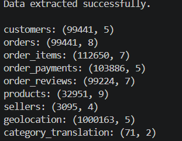
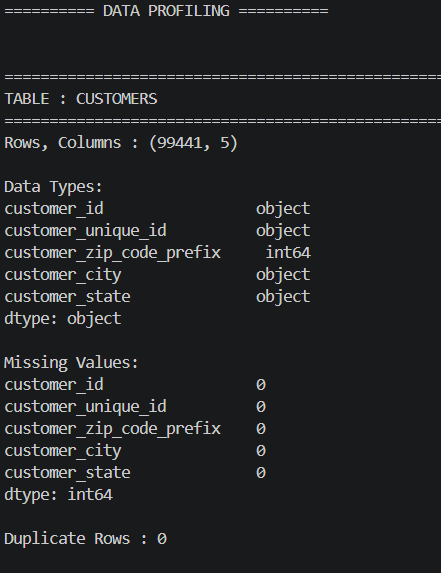
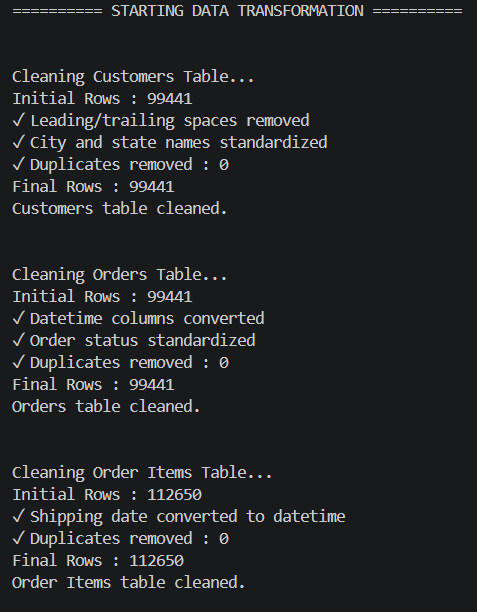
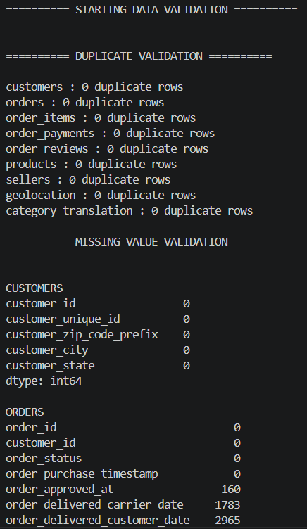
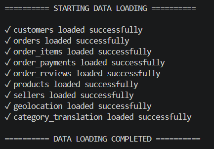

# Sales Data Cleaning Pipeline


## End-to-End ETL Pipeline using Python, Pandas & PostgreSQL

An end-to-end **ETL (Extract, Transform, Load)** pipeline built using **Python**, **Pandas**, and **PostgreSQL**. This project extracts raw sales data from the **Olist Brazilian E-Commerce Dataset**, profiles and cleans the data, validates data quality, and loads the transformed datasets into PostgreSQL while preserving relationships using **Primary Keys** and **Foreign Keys**.

---

# Database Schema

The cleaned data is loaded into PostgreSQL and connected using relational constraints to preserve data integrity.


---

# ETL Workflow

```text
Raw CSV Files
      │
      ▼
Data Extraction
      │
      ▼
Data Profiling
      │
      ▼
Data Cleaning & Transformation
      │
      ▼
Data Validation
      │
      ▼
Load into PostgreSQL
      │
      ▼
Apply Primary & Foreign Keys
```

---

# Project Overview

This project demonstrates a complete Data Engineering workflow from raw datasets to a clean relational database.

The pipeline includes:

- Data Extraction
- Data Profiling
- Data Cleaning
- Data Transformation
- Data Validation
- PostgreSQL Data Loading
- Database Schema Creation

---

# Tech Stack

| Category | Technologies |
|----------|--------------|
| Programming | Python |
| Data Processing | Pandas |
| Database | PostgreSQL |
| ORM | SQLAlchemy |
| Database Driver | Psycopg2 |
| Environment Variables | Python-dotenv |

---

# Dataset

**Dataset Used:** Olist Brazilian E-Commerce Dataset

The dataset contains multiple relational tables representing an online retail platform.

Tables included:

- Customers
- Orders
- Order Items
- Order Payments
- Order Reviews
- Products
- Sellers
- Geolocation
- Product Category Translation

---

# Project Structure

```text
sales-data-cleaning-pipeline/
│
├── data/
│   ├── raw/
│   └── cleaned/
│
├── screenshots/
│
├── sql/
│   └── constraints.sql
│
├── src/
│   ├── extract.py
│   ├── transform.py
│   ├── validation.py
│   └── load.py
│
├── .env.example
├── .gitignore
├── main.py
├── requirements.txt
├── LICENSE
└── README.md
```

---

# Data Extraction

The pipeline begins by extracting multiple CSV files into Pandas DataFrames.

### Tasks Performed

- Read raw CSV files
- Loaded multiple datasets
- Stored datasets in a dictionary for processing



---

# Data Profiling

Initial profiling helps understand the quality of raw data before transformation.

Checks performed:

- Dataset dimensions
- Data types
- Missing values
- Duplicate rows



---

# Data Cleaning & Transformation

Different cleaning strategies were applied to different tables.

### Customers

- Removed leading/trailing spaces
- Standardized city names
- Standardized state names
- Removed duplicate records

### Orders

- Converted timestamps to datetime
- Standardized order status
- Removed duplicates

### Order Items

- Converted shipping dates
- Removed duplicates

### Payments

- Standardized payment types
- Identified invalid payment values

### Reviews

- Converted review timestamps
- Preserved business-valid NULL review comments

### Products

- Filled missing categories with **Unknown**
- Filled missing numerical values using median
- Removed duplicates

### Sellers

- Standardized city and state names

### Geolocation

- Removed duplicate records
- Standardized city and state names

### Category Translation

- Standardized category names
- Removed duplicates



---

# Data Validation

The transformed datasets are validated before loading.

Validation includes:

- Duplicate validation
- Missing value validation
- Customer ID validation
- Product ID validation
- Seller ID validation
- Order ID validation



---

# Data Loading

After successful validation, the cleaned datasets are loaded into PostgreSQL using SQLAlchemy.

Each DataFrame is automatically converted into a PostgreSQL table.



---

# How to Run

## 1. Clone the Repository

```bash
git clone https://github.com/your-username/sales-data-cleaning-pipeline.git
```

---

## 2. Install Dependencies

```bash
pip install -r requirements.txt
```

---

## 3. Create a `.env` File

```env
DB_USER=your_username
DB_PASSWORD=your_password
DB_HOST=localhost
DB_PORT=9111
DB_NAME=sales_pipeline
```

---

## 4. Run the Pipeline

```bash
python main.py
```

---

## 5. Apply Database Constraints

Execute the SQL script below after the pipeline completes successfully.

```text
sql/constraints.sql
```

---

# Project Features

- End-to-End ETL Pipeline
- Modular Project Structure
- Automated Data Profiling
- Data Cleaning & Transformation
- Data Validation
- PostgreSQL Integration
- Primary & Foreign Key Constraints
- Secure Environment Variables using `.env`

---

# Future Improvements

- Apache Airflow Integration
- Docker Support
- Logging
- Unit Testing
- Data Quality Reports
- AWS Deployment
- CI/CD Pipeline

---

# Author

**Vikas Mishra**

If you found this project helpful, consider giving it a ⭐ on GitHub.
